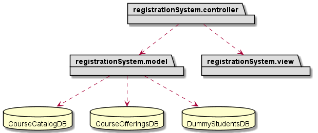
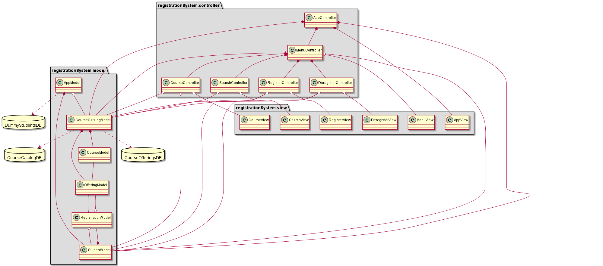

# Lab Assignment 3

ENSF 607 - Fall 2021

## Due Dates

Submission before 11:59 PM on Friday, October 8

Demonstration on Friday, October 8

## Objectives

In Lab Assignment 1 you were tasked by creating a student registration system based on the UML diagram given to you in the lecture material. In this assignment, you will modify the design of your application to MVC. Your final submission should have the same functionality of the application you developed in lab 1. However, for this assignment you must have a GUI instead of a console-based application.

The deliverables for this assignment include:

- Modified UML diagram(s) to show case your design. You may choose to have more than one UML diagram to show a meaningful high-level and low-level view of the system. UML package diagram and class diagram are appropriate to use.

- Your Java application which must be delivered in 3 packages:
   - Model
   - View
   - Controller

- Students will demo their project to their TA **during the lab on Friday October 8th**

- Students must submit their lab to the Git repository by **11:59 on Monday October 8th**

## Structuring

+ Launch the program by using `run.cmd` or `run.sh` based on your machine

+ Source code present in the directory [src](src)

+ Resource files present in the directory [lib](lib)

+ GUI screenshots present in the directory [screenshots](screenshots)

+ UML diagrams and their source code present in the directory [uml](uml)

## UML Diagrams

1. UML diagram - high level
   
   

2. UML diagram - detailed
   
   

## Submitted by

**Name** - Bhavyai Gupta  
**UCID** - 30143691
