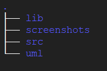
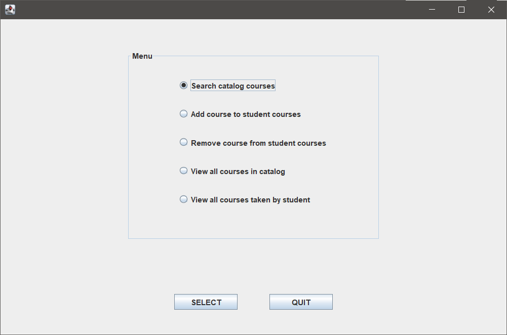
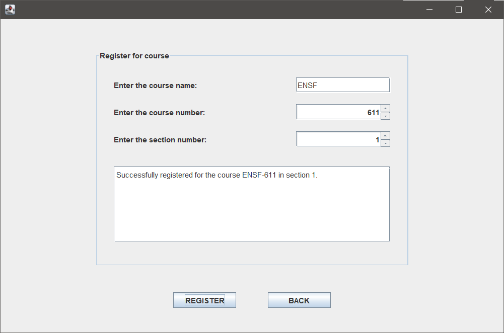
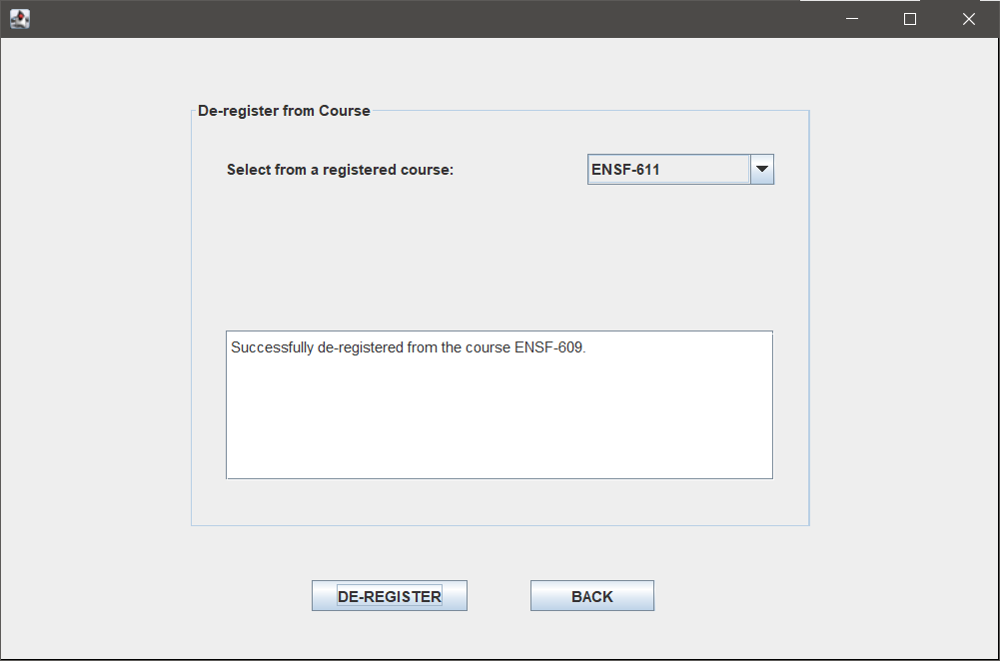

# Course Registration System

A swing GUI based course registration system


## Features

+ Search the course catalog

+ Register for course only if pre-requisites are met

+ Maximum registration of upto six courses

+ De-register from a course

+ List registered courses


## Program Structure



+ [lib](lib) - contains resource files

+ [screenshots](screenshots) - contains GUI screenshots

+ [src](src) - contains source code

+ [uml](uml) - contains UML code and the generated UML diagrams


## Dependencies

+ JDK version 11.0.11 or above


## How to run

1. Clone the repository on your machine

2. If you are using Windows OS, simply double on the [`run.cmd`](run.cmd) file. If you are using unix based OS, run the below command in the project directory
   ```bash
   $ ./run.sh
   ```


## UML Diagrams

1. UML diagram - high level
   
   

2. UML diagram - detailed
   
   


## Screenshots

See all screenshots [here](screenshots)

+ Menu options
   
   

+ Registration

   

+ De-registration

   
